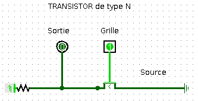
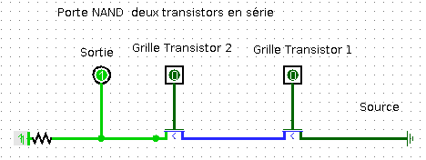
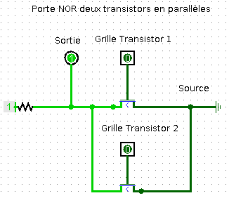
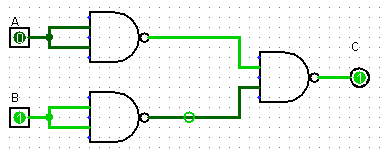
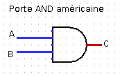
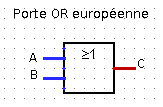
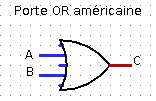

---
title : Circuits logiques
author : Terminale ISN Lycée du Parc
numbersections: true
fontsize: 11pt
geometry:
- top=20mm
- left=20mm
- right=20mm
- heightrounded    
--- 

# Crédits {-} 
 
_Ce cours est largement inspiré du chapitre 22 du manuel NSI de la collection Tortue chez Ellipsen auteurs : Ballabonski, Conchon, Filliatre, N'Guyen._
      
# Préambule {-}

Les circuits d'une ordinateur manipulent uniquement des 0 ou des 1 représentés en interne par des tensions hautes ou basses. Les premiers ordinateurs construits dans la période 1945-1950 sont basés sur une technologie de tube à vide ou tube électrique. En 1947, aux laboratoires Bell, [Shockley, Bardeen et Brattain](https://fr.wikipedia.org/wiki/Transistor) inventent le __transistor__ au _germanium_ un petit composant électronique qui se comporte comme un interrupteur.  Les transistors, plus petits et dissipant moins de chaleur, vont supplanter les tubes électriques : en 1954 le _germanium_ est remplacé par le _silicium_, en 1955 apparaissent les premiers ordinteurs entièrement transistorisés, en 1960 le transistor à effet de champ permet l'intégration de dizaines composants dans un centimètre carré. Les transistors sont ensuite directement gravés dans une plaque de _silicium_ constitutant un __cicrcuit intégré__. En 1965 Gordon Moore futur directeur d'Intel énonce la [loi empirique](https://fr.wikipedia.org/wiki/Loi_de_Moore) portant son nom qui fixe une feuille de route à l'industrie des mircroprocesseurs :  le doublement de la densité d'intégration des transistors tous les deux ans. Cette loi s'est vérifiée jusqu'à présent avec une finesse de gravure d'environ 5 nanomètres en 2020.  Le [graphique](https://en.wikipedia.org/wiki/Moore%27s_law#/media/File:Moore's_Law_Transistor_Count_1971-2018.png) ci-dessous représente l'évolution du  nombre de transistors par circuit intégré.

:::center
{width=90%}\
:::

# Portes logiques

## Le transistor porte logique de base

:::definition
Un __transitor__ possède trois broches : la grille, la  sortie (ou drain) et la source soumis à des états de tension haute ou basse qu'on peut assimiler aux valeurs binaires 1 et 0 d'un __bit__. Si la tension appliquée sur la grille est haute (bit à  1) alors le transitor laisse passer le courant entre la source d'énergie et la sortie et ce dernier passe à l'état de tension basse (bit à 0), sinon la sortie reste en tension haute (bit  1).

Une __fonction logique__ prend un ou plusieurs bits en entrée et retourne un ou plusieurs bits en sortie. Une __table logique__  représente toutes les sorties produites par une fonction logique pour toutes les entrées possibles.

Un transistor représente une fonction logique dont le bit d'entrée est l'état de tension de la grille  et le bit de sortie, l'état de tension de la sortie. La __table logique__  (table 1) associée est celle du  __NON logique__ ou __Inverseur__.

Fichier de test [Logisim](http://www.cburch.com/logisim/) : [transistor.circ](circuits_logisim/transistor.circ).
:::
:::center
{width=50%}\
:::

Table: __Table logique  d'une porte NON__  

| A      | B = NON(A)   |
|:------:|------|
| 0      | 1    |
| 1      | 0    |

**Il existe deux conventions de représentation symbolique des portes logiques, une européenne et une américaine.**

:::{.minipage width="0.5\linewidth" centre="true"}
\
&
\
:::

 
## D'autres portes logiques

### Transistors en série ou en parallèle

:::exercice
On donne ci-dessous les représentations de deux portes logiques :

* La __porte NAND__ constituée de deux transistors en série 
* La __porte NOR__ constituée de deux transistors en parallèle 

Chacune de  ces portes logiques comportent deux   bits d'entrée : A pour  la grille du transistor 1 et B pourla grille du transistor 2 et un bit de sortie.

Compléter leurs tables logiques.

Vérifier avec [Logisim](http://www.cburch.com/logisim/) et les fichiers [porte_NAND.circ](circuits_logisim/porte_NAND.circ) et [porte_NOR.circ](circuits_logisim/porte_NOR.circ).

| A      | B    | NAND(A, B) |
|:------:|------|------------|
| 0      | 0    |            |
| 0      | 1    |            |
| 1      | 0    |            |
| 1      | 1    |            |

| A      | B    | NOR(A, B) |
|:------:|------|------------|
| 0      | 0    |            |
| 0      | 1    |            |
| 1      | 0    |            |
| 1      | 1    |            |
:::

:::{.minipage width="0.5\linewidth" center="true"}
{width="80%"}\
&
{width="80%"}\
:::

  
**Voici les  représentations symboliques des  portes logiques NAND et NOR :**

:::{.minipage width="0.5\linewidth" center="true"}
\
&
\
:::

:::{.minipage width="0.5\linewidth" center="true"}
\
&
\
:::

   
### Portes logiques et fonctions logiques élémentaires

:::exercice
Fichier de test [Logisim](http://www.cburch.com/logisim/) : [exercice2.circ](circuits_logisim/exercice2.circ).

1. Compléter la table logique de la porte logique représentée par le circuit ci-dessous. Quelle porte logique peut-on ainsi représenter ?

\

| A      | B = f(A)   |
|:------:|------|
| 0      |      |
| 1      |      |

2.  Compléter la table logique de la porte logique représentée par le circuit ci-dessous. Quelle fonction logique correspond à cette porte logique ?
 
{width=60%}\

| A      | B    | C = g(A, B)    |
|:------:|------|------------|
| 0      | 0    |            |
| 0      | 1    |            |
| 1      | 0    |            |
| 1      | 1    |            |

:::

:::exercice
Fichier de test [Logisim](http://www.cburch.com/logisim/) : [exercice3.circ](circuits_logisim/exercice3.circ).

1. Compléter la table logique de la porte logique représentée par le circuit ci-dessous. Quelle porte logique peut-on ainsi représenter ?

\

| A      | B = f(A)   |
|:------:|------|
| 0      |      |
| 1      |      |

2.  Compléter la table logique de la porte logique représentée par le circuit ci-dessous. Quelle fonction logique correspond à cette porte logique ?
 
{width=60%}\

| A      | B    | C = g(A, B)    |
|:------:|------|------------|
| 0      | 0    |            |
| 0      | 1    |            |
| 1      | 0    |            |
| 1      | 1    |            |

:::

**Voici les  représentations symboliques des  portes logiques `AND` et `OR` :**

:::{.minipage width="0.5\linewidth" center="true"}
\
&
\
:::

:::{.minipage width="0.5\linewidth" center="true"}
\
&
\
:::

:::exercice

1. Construire un circuit représentant une porte `OR` uniquement avec des portes `NOR`.
2. Construire un circuit représentant une porte `AND` uniquement avec des portes `NAND`.

Ainsi chacune des portes, `NAND` ou `OR` permet de construire les portes `NOT`, `OR`, `AND`. Toute porte logique  pouvant s'exprimer à l'aide de ces trois portes, les portes `NAND` et `OR` sont dites *universelles*.
:::

# Fonctions booléennes

## Fonctions booléennes

:::definition

* Un __booléen__ est un type de données pouvant prendre deux valeurs  `True` (Vrai)  ou `False` (Faux)  qu'on  représente  numériquement par un __bit__ de valeur $1$ pour `True` ou $0$ pour `False`. Electroniquement, les valeurs 1 et 0 se traduisent  respectivement par des tensions haute ou basse.
* Une __fonction booléenne__ $f$ associe un booléen à un ou plusieurs booléens. 
* Une __fonction booléenne__ avec $n$ arguments est définie sur un ensemble $\{0;1\}^n$ à $2^n$ valeurs et prend ses valeurs dans $\{0;1\}$ qui a $2$ éléments. On peut recenser les $2^n$ évaluations  d'une fonction booléenne à $n$ arguments  dans une __table de vérité__ qui la  définit entièrement. Il existe $2^{2^n}$ fonctions booléennes à $n$ arguments.
* Une __porte logique__ est la représentation sous forme de circuit d'une fonction booléenne et sa __table logique__ est la __table de vérité__  de cette fonction.
  
:::

:::exercice

1. Compléter la  fonction `Python` ci-dessous pour qu'elle affiche la table de vérité d'une fonction booléenne à deux entrées. Expliquer le rôle de la fonction `int`.

~~~python
def table_verite_2bits(fonction):
    print('|{:^10}|{:^10}|{:^15}|'.format('a','b',fonction.__name__+'(a,b)'))
    for a in .............:
        for b in .............:
            print('|{:^10}|{:^10}|{:^15}|'.format(......, ......, 
            int(fonction(bool(a),bool(b)))))
~~~

1. Vérifier que  les tables de vérité affichées pour les fonctions `bool.__or__`, `bool.__and__`  et `bool.__not__` sont correctes.

~~~python
In [4]: table_verite_2bits(bool.__or__)                                                                                                                                           
|    a     |    b     |  __or__(a,b)  |
|    1     |    1     |       1       |
|    1     |    0     |       1       |
|    0     |    1     |       1       |
|    0     |    0     |       0       |
~~~
:::

:::propriete

On peut exprimer toute fonction booléenne à l'aide de trois fonctions booléennes élémentaires :

* La _négation_ de $x$  est une fonction à 1 bit d'entrée (unaire) notée $\neg x$ ou $\overline{x}$.  
Si `x` est un booléen, sa _négation_ est `not x` en `Python`. 
  
| $x$ | $\neg x$ |
|:-:|----------|
| 0 |          |
| 1 |          |

* La _conjonction_ de $x$ et $y$  est une fonction à 2 bits d'entrée (binaire) notée $x \wedge y$ ou $x . y$.  
Si `x` et `y` sont des booléens, leur  _conjonction_ est `x and y` en `Python`. 

| $x$ | $y$ | $x \wedge y$ |
|:---:|-----|--------------|
| 0   | 0   |              |
| 0   | 1   |              |
| 1   | 0   |              |
| 1   | 1   |              |

* La _disconjonction_ de $x$ et $y$  est une fonction à 2 bits d'entrée (binaire) notée $x \vee y$ ou $x + y$.  
Si `x` et `y` sont des booléens, leur  _disjonction_ est `x or y` en `Python`

| $x$ | $y$ | $x \vee y$ |
|:---:|-----|--------------|
| 0   | 0   |              |
| 0   | 1   |              |    
| 1   | 0   |              |   
| 1   | 1   |              |
:::   

:::propriete
1. Les fonctions booléennes élémentaires respectent un certain nombre de règles qui permettent de simplifier les expressions booléennes complexes :

* _opérateur involutif_ :  $\neg(\neg x) = x$ et $\overline{\overline{x}}=x$
* _élément neutre_ :   $1 \wedge x = x$ et $1 . x =x$  ou  $0 \vee x = x$ et $0 + x =x$
* _élément absorbant_ :   $0 \wedge x = 0$ et $0 . x =0$  ou  $1 \vee x = x$ et $1 + x =1$
* _idempotence_ : $x \wedge x = x$ et $x . x =x$  ou  $x \vee x = x$ et $x + x =x$
* _complément_ : $x \wedge (\neg x) = 0$ et $x . (\overline{x}) =0$  ou  $x \vee (\neg x) = 1$ et $x + \overline{x} =1$
* _commutativité_ :  $x \wedge y = y \wedge x$ et $x . y = y . x$  ou  $x \vee y = y \vee x$ et $x + y = y + x$
* _associativité_ :  $x \wedge ( y \wedge z) = (x \wedge  y) \wedge z$ et $x . (y . z) = (x . y) . z$  ou  $x \vee ( y \vee z) = (x \vee y) \vee z$ et $x + (y + z) = (x + y) + z$
* _distributivité_ :  $x \wedge ( y \vee z)  = (x \wedge  y) \vee (x \wedge z)$ et $x . (y + z) = x . y + x   z$  ou  $x \vee ( y \wedge z)  = (x \vee  y) \wedge (x \vee z)$ et $x + (y . z) = (x + y) . (x + z)$
* _loi de Morgan_ : $\neg(x \wedge y) = \neg x \vee \neg y$ et   $\overline{x . y} = \overline{x} + \overline{y}$ ou  $\neg(x \vee y) = \neg x \wedge \neg y$ et   $\overline{x + y} = \overline{x} . \overline{y}$

2. Les fonctions booléennes élémentaire respectent des règles de priorité :  la _négation_ est prioritaire sur la _conjonction_ qui est proritaire sur la _disjonction_.  
__Il est recommandé de mettre des parenthèses plutôt que d'appliquer les règles de priorité dans l'écriture des expressions booléennes.__
:::

##  Dresser la table de vérité d'une fonction booléenne

:::exercice
Démontrer dans chaque cas l'égalité des expressions booléennes en utilisant les deux méthodes suivantes :

* __Méthode 1__ : en comparant les tables de vérité des deux expressions booléennes ;

* __Méthode 2__ : en utilisant les règles de simplification de la propriété 2.

1. $x + x . y = x$
2. $x + \overline{x} . y= x + y$
3. $x . z + \overline{x} . y + y . z = x . z + \overline{x} . y$
4. $\overline{y . (x + \overline{y})} = \overline{x} + \overline{y}$
5. $x . ( \overline{x} + \overline{y}) . (x + y) = x . \overline{y}$

:::

## Exprimer une fonction booléenne à partir de sa table de vérité 

:::exercice
On considère la fonction booléenne dont la table de vérité est :

| $x$ | $y$ |  $f(x, y)$ |
|:---:|-----|-------------|
| 0   | 0   |      0      |
| 0   | 1   |      1      |
| 1   | 0   |      1      |
| 1   | 1   |      0      |

1. Exprimer chacune des lignes où la fonction prend la valeur $1$ comme la _conjonction_ des entrées en remplaçant chaque $1$ par la variable qu'il représente et chaque $0$ par la négation de la variable. Par exemple le $1$ de la deuxième ligne s'écrira $\overline{x} . y$.
2. On peut alors écrire $f(x,y)$ comme la _disjonction_ des _formes conjonctives_ obtenues à la question précédente. En déduire une expression booléenne de $f(x, y)$.
3.  Ouvrir le logiciel [Logisim](http://www.cburch.com/logisim/) et construire une porte logique représentant cette fonction booléenne.
4.  Cette fonction s'appelle `OU EXCLUSIF` ou `XOR`. Ce nom vous paraît-il bien choisi ?

:::

**Voici les  représentations symboliques de la  porte logique `XOR` :**

:::{.minipage width="0.5\linewidth" center="true"}
\
&
\
:::

# Circuits combinatoires 

## Définition

:::definition
Un __circuit logique combinatoire__ permet de réaliser une ou plusieurs fonctions booléennes : ses sorties ne dépendent que de l'état actuel de ses entrées. Les portes logiques `NOT`, `NOR`, `NAND`, `AND`, `OR` et `XOR` sont des circuits combinatoires. 

Il existe d'autres circuits, dits séquentiels, dont les sorties se calculent non seulement à partir de leurs  valeurs d’entrée actuelles mais aussi à partir de leurs états précédents : le facteur temps intervient. Ils utilisent des circuits de mémoire pour mémoriser leurs états antérieurs.
:::

:::exercice

On considère la fonction booléeenne $f$ dont la table de vérité est donnée ci-dessous :

| $x$ | $y$ |  $f(x, y)$ |
|:---:|-----|-------------|
| 0   | 0   |      1      |
| 0   | 1   |      0      |
| 1   | 0   |      0      |
| 1   | 1   |      1      |

1. En utilisant la méthode exposée dans l'exercice , déterminer une expression booléenne de la fonction $f$.
2. Ouvrir le logiciel [Logisim](http://www.cburch.com/logisim/) et construire un circuit combinatoire  représentant cette fonction booléenne : 

   * En utilisant les portes logiques `NOT`, `NOR`, `NAND`, `AND`, `OR` ou `XOR`.
   * En n'utilisant que des portes logiques `NOT`, `AND` ou  `OR`.
   * En n'utilisant que des portes logiques  `NOR`.

:::

## Décodeur avec 2 bits d'entrées

:::exercice

On considère un circuit combinatoire qui  possède deux entrées $e_{0}$ et $e_{1}$ et quatre sorties $s_{0}$, $s_{1}$, $s_{2}$ et $s_{3}$.

La sortie indexée par le nombre dont le bit de poids faible est $e_{0}$ et le bit de poids fort $e_{1}$ est postionnée à $1$ et les autres sorties à $0$. Ce circuit est ainsi appelé __décodeur $2$ bits__.

1. Compléter la table de vérité de ce circuit combinatoire.

| $e_{0}$ | $e_{1}$ |  $s_{0}$  | $s_{1}$ | $s_{2}$ |  $s_{3}$ |
|:-------:|---------|-----------|---------|---------|----------|
| 0       | 0       |           |         |         |          |
| 0       | 1       |           |         |         |          |
| 1       | 0       |           |         |         |          |
| 1       | 1       |           |         |         |          |

2. En utilisant la méthode exposée dans l'exercice 7, déterminer une expression booléenne de chacune des sorties $s_{0}$, $s_{1}$, $s_{2}$ et $s_{3}$, en fonction des entrées $e_{0}$ et $e_{1}$.

3. Ouvrir le logiciel [Logisim](http://www.cburch.com/logisim/) et construire un circuit combinatoire  représentant un __décodeur $2$ bits__.
:::

## Demi-additionneur et additionneur  1 bit

:::exercice

1. Effectuer les additions binaires : $0+0$, $0+1$, $1+0$ et $1+1$.

2. Un __demi-additionneur binaire 1 bit__  est  un circuit combinatoire qui  possède :

    * deux entrées : deux bits d'opérande $e_{0}$ et $e_{1}$ ;
    * deux sorties : un bit de résultat  $s$ et un bit de retenue  sortante $r$.

La sortie $s$ prend pour valeur le bit des unités et la sortie $r$ le bit de retenue sortante, lorsqu'on additionne les deux bits d'entrée $e_{0}$ et $e_{1}$.

1. Compléter la table de vérité de ce circuit combinatoire :

| $e_{0}$ |  $e_{1}$ | $s$ | $r$ |
|:-------:|----------|---|---|
| 0       | 0        |   |   |
| 0       | 1        |   |   |
| 1       | 0        |   |   |
| 1       | 1        |   |   |

4. Justifier qu'un __demi-additionneur binaire 1 bit__  peut être représenté par le circuit ci-dessous.

{width="50%"}\

5. Ouvrir le logiciel [Logisim](http://www.cburch.com/logisim/) et construire un circuit combinatoire  représentant un __demi-additionneur binaire 1 bit__.
:::

:::exercice

Un __additionneur binaire   1 bit__ est  un circuit combinatoire qui  possède :

   * trois entrées : deux bits d'opérande $e_{0}$ et $e_{1}$ et un bit de retenue entrante $r_{0}$
   * deux bits de sortie : un bit de résultat  $s_{2}$ et un bit de retenue  sortante $r_{3}$.

1. Compléter les colonnes de la table de vérité d'un __additionneur binaire   1 bit__  pour le bit de résultat $s_{2}$ et le bit  retenue  sortante $r_{3}$.

| $e_{0}$ | $e_{1}$ | $r_{0}$ | $s_{1}=\ldots \ldots$ | $r_{1}=\ldots \ldots$ | $s_{2}=\ldots \ldots$ | $r_{2}=\ldots \ldots$ |  $r_{3}=\ldots \ldots$ |
|:-------:|---------|---------|---------------------------|-----------------------|---------------------------|-----------------------|------------------------|
| 0       | 0       | 0       |                           |                       |                           |                       |                        |
| 0       | 1       | 0       |                           |                       |                           |                       |                        |
| 1       | 0       | 0       |                           |                       |                           |                       |                        |
| 1       | 1       | 0       |                           |                       |                           |                       |                        |
| 0       | 0       | 1       |                           |                       |                           |                       |                        |
| 0       | 1       | 1       |                           |                       |                           |                       |                        |
| 1       | 0       | 1       |                           |                       |                           |                       |                        |
| 1       | 1       | 1       |                           |                       |                           |                       |                        |
2. Un __additionneur binaire   1 bit__ peut être réalisé à l'aide de deux __demi-additionneurs binaires 1 bit__ :

   * Le premier __demi-additionneur binaire 1 bit__ prend en entrée les bits d'opérande $e_{0}$ et $e_{1}$ et retourne en sortie un bit de résultat intermédiaire $s_{1}$ et un bit de retenue sortante intermédiaire $r_{1}$. Donner une expression booléenne de $s_{1}$ et $r_{1}$ en fonction de $e_{0}$ et $e_{1}$.
   * Le second __demi-additionneur binaire 1 bit__ prend en entrée le bit de résultat $s_{1}$ et le bit de retenue entrante $r_{0}$ et retourne en sortie le bit de résultat  final $s_{2}$ et un bit de retenue sortante intermédiaire $r_{2}$. Donner une expression booléenne de $s_{2}$ et $r_{2}$ en fonction de $s_{1}$ et $r_{0}$.
   * Enfin, la retenue sortante $r_{3}$ s'obtient à partir  de la retenue sortante $r_{1}$ du premier demi-additionneur et de la rentenue sortante $r_{2}$ du second. Donner une expression booléenne de $r_{3}$ en fonction de $r_{1}$ et $r_{2}$.

    Compléter les colonnes $s_{1}$, $r_{1}$ et $r_{2}$ de la table de vérité de __additionneur binaire à  1 bit__.

3. Avec le logiciel [Logisim](http://www.cburch.com/logisim/) ouvrir le fichier contenant le demi-additionneur de l'exercice précédent.  
    * Ajouter un nouveau circuit avec `Add a circuit` , le nommer `additionneur1bit` puis copier/coller dedans le circuit du __demi-additionneur binaire 1 bit__. Compléter le  circuit  pour obtenir  un __additionneur binaire 1 bit__.
    * Ajouter un nouveau circuit avec `Add a circuit` , le nommer `additionneur2bits` puis copier/coller dedans le circuit de l' __additionneur binaire 1 bit__. Compléter le  circuit   pour obtenir  un __additionneur binaire 2 bits__.
:::

## Simuler le hasard

:::exercice
Dans cet exercice, on veut réaliser un circuit logique qui simule un dé électronique à diodes (LED).

Les différentes combinaisons d’affichage du dé électronique sont représentées dans la
figure ci-dessous :

{width="80%"}\

Par exemple, si on veut afficher 3, il faut allumer les diodes a, d et g. Pour les combinaisons d'entrée (x,y,z)= (0,0,0,) et (X,Y,Z)=(1,1,1) aucune diode ne doit être allumée.

Il s'agit d'une forme de __transcodeur 3 bits vers 8 bits__. Les $3$ bits d'entrée  représentent le codage d'un nombre sur $3$ bits en notation positionnelle et les $8$ bits de sortie représentent le codage de ce même nombre en notation additive. Par exemple si (x,y,z) = (1,0,1) en entrée, le nombre est $1 \times 2^{2} + 0 \times 2^{1} + 1 \times 2^{0}=5$ et il est représenté par cinq bits de sortie positionnés à $1$. Pour simuler un dé à 6 faces, deux entrées,   (x,y,z) = (0,0,0) et (x,y,z) = (1,1,1),  correspondent à la même  sortie (tous les bits de sortie à 0), c'est pourquoi on peut réduire le nombre de sorties de $8$ à $7$.

Le circuit à réaliser doit donc comporter 7 sorties, soit une sortie par diode (a, b, c, d, e, f, g) et 3 entrées x, y, z.

{width="60%"}\

1. Compléter la table de vérité de ce circuit :
   
| x | y | z | a | b | c | d | e | f | g |
|:-:|---|---|---|---|---|---|---|---|---|
| 0 | 0 | 0 |   |   |   |   |   |   |   |
| 0 | 0 | 1 |   |   |   |   |   |   |   |
| 0 | 1 | 0 |   |   |   |   |   |   |   |
| 0 | 1 | 1 |   |   |   |   |   |   |   |
| 1 | 0 | 0 |   |   |   |   |   |   |   |
| 1 | 0 | 1 |   |   |   |   |   |   |   |
| 1 | 1 | 0 |   |   |   |   |   |   |   |
| 1 | 1 | 1 |   |   |   |   |   |   |   |

2. Ouvrir le logiciel [Logisim](http://www.cburch.com/logisim/). Aller dans `Windows - Combinational - Analysis` :
    * dans l'onglet `Input` , indiquer les variables d'entrée du transcodeur ( x , x , z ) ;
    * dans l'onglet `Output`, indiquer les variables de sortie ( a ,.... , g ) ;
    * dans `Table` , saisir la table de vérité de chaque sortie ;
    * dans `Expression` , on peut obtenir une expression booléenne  pour chaque de sortie, et dans `Minimized` une expression simplifiée.
    * construire le circuit  avec le bouton `Build circuit`  et le  nommer `de6faces`
    * compléter le circuit avec des `Random Generator` (outils `Memory`) en entrée et des `LED` (outils `Input - Output`) en sortie comme dans la figure ci-dessous.

:::

{width="45%"}\

# Opérations bit à bit en `Python`

:::propriete

Les fonctions booléennes élémentaires (`OR`, `AND`, `NOT`, `XOR`) existent en `Python` sous la forme d'opérateurs booléens mais sont également implémentés sous la forme d'opérateurs bit à bit sur les nombres. Un _opérateur bit  à bit_ (_bitwise_ en anglais) s'applique sur les bits de même poids des  représentations binaires de ses opérandes. 

-------------------------------------------------------------------------------
Opérateur booléen      Opérateur bit à bit  Exemple                                 
---------------------- -------------------  --------------------------------------------
`and` , ET             `&`                  `>>> bin(0b101001 & 0b101010)`

                                            `'0b101000'` 

`or` , OU              `|`                  `>>> bin(0b101001 | 0b101010)`

                                            `'0b101011'` 

`xor` , OU EXCLUSIF    `^`                  `>>> bin(0b101001 ^ 0b101010)`

                                            `'0b000011'` 
                                   
`not` ,  NEGATION      `~`                  `>>> ~5 #~x retourne -x - 1`

                                            `-6`

--------------------------------------------------------------------------------
:::

Exemples d'utilisation d'opérateurs bit à bit :

* On  peut utiliser le `ET` bit à bit pour sélectionner uniquement certains bits, par exemple les bits de rang pairs :

~~~python
>>> bits_pairs = sum(2 ** k for k in range(0, 8, 2))
>>> bin(bits_pairs)
'0b1010101'
>>> bin(183)
'0b10110111'
>>> bin(183 & bits_pairs)
'0b10100010'
~~~

*  Le `OU EXCLUSIF` peut servir à masquer / démasquer une partie de la représentation binaire d'un nombre (on peut l'employer avec tout objet codé numériquement comme une image ou un caractère).

~~~python
>>> diego = 69
>>> masque = 42
>>> zorro = diego ^ masque
>>> zorro
111
>>> zorro ^ masque
69
~~~
:::exercice

Dans un réseau `IP` l'adresse `IP` d'une machine est constitué d'un préfixe correspondant à l'adresse du réseau (commune à toutes les machines du réseau) et à un suffixe machine, identifiant la machine sur le réseau. 

Le préfixe réseau s'obtient à partir de l'adresse `IP` de la  machine en faisant un `ET` bit à bit avec le masque de sous-réseau.

Par exemple si l'adresse est  `192.168.11.12`  de représentation binaire `11000000.10101000.00001011.00001011` et le masque de sous-réseau est `255.255.252.0` de représentation binaire 

`11111111.11111111.11111100.00000000` alors le préfixe réseau est `11000000.10101000.00001000.00000000`  soit `192.168.8.0`.

On donne ci-dessous deux fonctions outils :

~~~python
def ip2liste(ip):
    "Transforme une  adresse IP V4 (type str) en liste d'entiers"
    return [int(champ) for champ in ip.split('.')]

def liste2ip(ipliste):
    "Transforme une  liste d'entiers en adresse IP V4 (type str)"
    return '.'.join(str(n) for n in ipliste)
~~~

1. Écrire une fonction de signature `prefixe_reseau(ip, masque)` qui retourne le préfixe réseau sous forme d'adresse IP V4 (type `str`) à partir d'une adresse IP V4 et d'un masque de sous-réseau.

2. Écrire une fonction de signature `suffixe_machine(ip, masque)` qui retourne le suffixe machine sous forme d'adresse IP V4 (type `str`) à partir d'une adresse IP V4 et d'un masque de sous-réseau.

Voici un exemple de résultat attendu :

~~~python
>>> prefixe_reseau('145.245.11.254','255.255.252.0')
'145.245.8.0'
>>> suffixe_machine('145.245.11.254','255.255.252.0')
'0.0.3.254'
~~~

:::

:::propriete

`Python` définit également des opérateurs sur les bits d'un nombre, plus efficaces que les opérations mathématiques équivalentes :

* Le décalage de `nombre` de  `n` bits vers la gauche multiplie `nombre` par $2^{n}$ et s'écrit  `nombre << n`.

* Le décalage de `nombre` de  `n` bits vers la droite divise `nombre` par $2^{n}$ et s'écrit  `nombre >> n`.
  
:::

:::exercice
Dans l'algorithme de recherche dichotomique, après  division en deux de  la zone de recherche, l'algorithme  s'appelle lui-même sur l'une des deux moitiés. C'est un algorithme de type \textit{Diviser pour régner} qui peut se programmer récursivement comme nous le verrons dans le chapitre sur la récursivité.

Si on note   \lstinline+n+ la taille de la liste, une autre implémentation, non récursive, est la suivante : 

* on commence la recherche au début de la liste et on avance avec un pas `pas = n // 2`   ou `pas = n >> 1` jusqu'au premier élément supérieur à l'élément cherché ;
* on repart de l'élément précédent le point d'arrêt  et on avance désormais avec un pas   
  
   `pas = pas >> 1` ;

* on répète en boucle ces instructions jusqu'à ce que le pas atteigne $1$.

A la fin de de la boucle, on détermine si l'élément sur lequel on s'est arrêté est l'élément recherché.

Compléter le code de la fonction `recherche_dicho2` qui implémente cet algorithme.

~~~python
def recherche_dicho2(L, e):
    x, n  = 0, len(L)
    pas = n >> 1
    while pas >= 1:
        while x + pas < n and .................:
            x = ..............
        pas = ................
    return ............
~~~

:::
